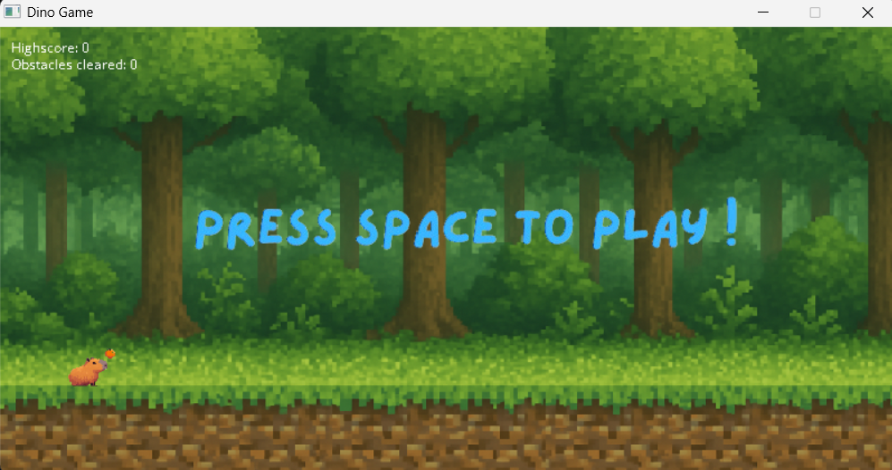
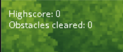

# Dino Game Ver 2

Tên: Hoàng Nguyên Vũ
Mã sinh viên: 24022846

I. Giới thiệu:

Đây là một trò chơi Endless Runner mô phỏng theo game khủng long của Chrome. Người chơi điều khiển Capybara nhảy để né chướng ngại vật càng lâu càng tốt.

II. Ngưỡng điểm đề xuất: 8.5

III. Lý do bảo vệ ngưỡng điểm:

1. Có áp dụng thư viện SDL, SDL mixer và SDL image để vẽ đồ họa, xử lý âm thanh, sự kiện bàn phím.
2. Trong game có :
   - Màn hình chờ
   - Game đang chạy
   - Game over
   - Có thể chơi lại bằng phím Enter, bắt đầu chơi bằng nút Space.
   - Có highscore và score đếm theo thời gian thực

3. Có nhạc nền và hiệu ứng âm thanh (khi nhảy, khi thua).
4. Có ý tưởng sáng tạo thay vì lấy nguyên dino thì lấy ý tưởng về capybara đang hot trend gần đây
